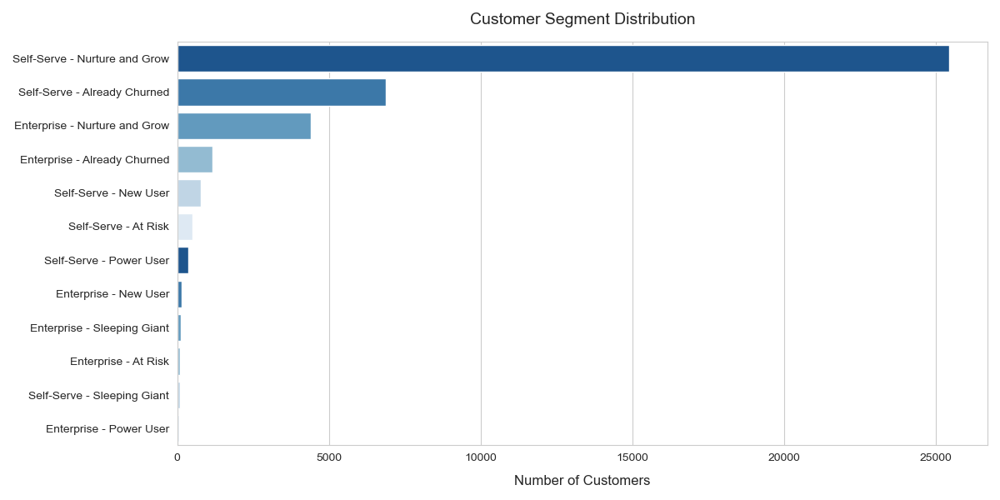
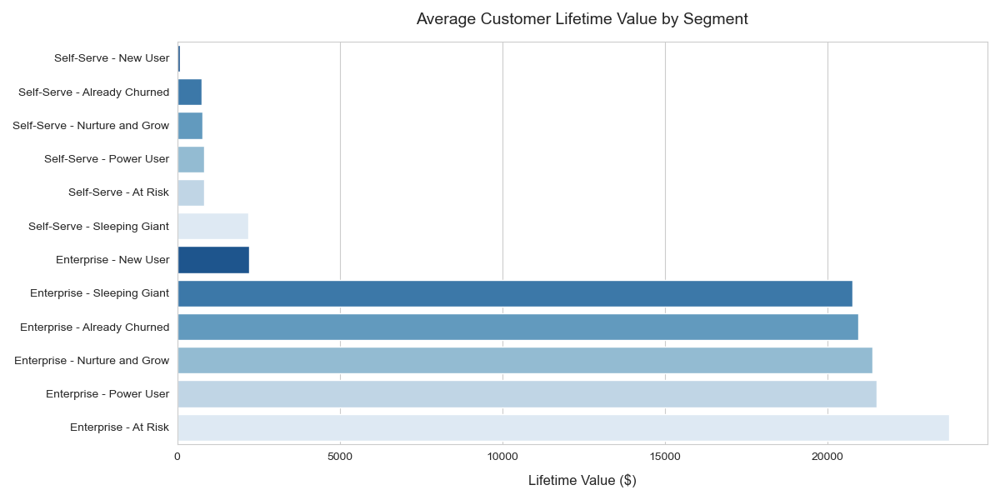

# SaaS Customers Segmentation Analysis
*Uncovering Strategic Growth and Retention Opportunities Across Customer Segments*

## Executive Summary

This analysis of 40,000+ SaaS customers reveals 12 highly actionable segments based on company type (Enterprise and Self-Serve), engagement level, and lifecycle status. These segments help customer success, marketing, and product teams prioritize users for upselling, retention, onboarding, or reactivation efforts.

### 🎯 Key Segments
| Segment Type        | Key Opportunities                         |
|---------------------|--------------------------------------------|
| **Self-Serve Power Users**      | Maximize LTV through expansion offers          |
| **Enterprise Power Users**      | Co-create, upsell, and retain                  |
| **Self-Serve / Enterprise At Risk** | Churn prevention through timely engagement  |
| **Sleeping Giants**            | Re-ignite high-potential but inactive users    |
| **New Users**                  | Optimize activation and onboarding             |
| **Churned**            | Analyze causes and test win-back strategies    |

---

## Customer Segments

### 🔥 Power Users (Enterprise + Self-Serve)
- **Traits**: High engagement, high session duration, active across features
- **Goal**: Keep them happy, upsell where possible, invite to feedback loops

---

### ⚠️ At Risk (Enterprise + Self-Serve)
- **Traits**: Previously active, now declining usage or dormant
- **Goal**: Trigger churn prevention workflows and personalized outreach

---

### 🛌 Sleeping Giants (Enterprise + Self-Serve)
- **Traits**: High revenue potential, minimal product interaction
- **Goal**: Strategic nudges, 1:1 onboarding, show value early

---

### ✨ New Users (Enterprise + Self-Serve)
- **Traits**: Recently onboarded, low current usage
- **Goal**: Accelerate onboarding, highlight core features in first 7 days

---

### 🌱 Nurture and Grow (Enterprise + Self-Serve)
- **Traits**: Moderate engagement, untapped product areas
- **Goal**: Educate, unlock use cases, and gradually increase product adoption

---

### 💔 Churned (Enterprise + Self-Serve)
- **Traits**: No recent activity, likely unsubscribed or disengaged
- **Goal**: Analyze churn patterns, test reactivation campaigns, gather feedback

---

## Customer Value Insights

### LTV Distribution Across Segments

- **Enterprise Power Users** drive a significant share of total revenue.
- **Sleeping Giants** hold high potential but require activation.
- **At-Risk users** still account for 20%+ of the existing LTV despite disengagement.

---

## Strategic Recommendations

| Segment                            | Priority Action                            |
|------------------------------------|---------------------------------------------|
| Power Users                        | Retain, co-create, expand                   |
| At Risk                            | Early alerts, recovery offers               |
| New Users                          | Improve onboarding funnel                   |
| Sleeping Giants                    | Targeted re-engagement and walkthroughs     |
| Nurture and Grow                   | Drive adoption through educating them        |
| Already Churned                   | Analyze and test win-back messaging         |

---

## 30-60-90 Day Action Plan

**Days 1–30**
- Design tailored onboarding journeys for Self-Serve and Enterprise New Users
- Implement churn-risk scoring model for At-Risk cohorts
- Launch monthly product success newsletter for Nurture and Grow users

**Days 31–60**
- A/B test upsell nudges for Power Users
- Build dashboards to monitor segment movement and health
- Interview churned customers to identify major drop-off points

**Days 61–90**
- Offer referral + freemium reactivation to Already Churned users
- Launch case study & co-creation program for Enterprise Power Users
- Design segment-specific growth playbooks

---

## Business Impact Targets

- 🎯 **Reduce churn in At-Risk segments** by 15% within 90 days
- 📈 **Increase feature adoption in Nurture and Grow** by 25%
- 💸 **Grow LTV by 20%** from Power Users through expansion offers
- 🚀 **Double activation rate** of New Users from 28% to 55%

---

## Final Thoughts

Segmentation is more than just analytics, it's a compass for growth. By aligning customer experiences to behavioral signals, your SaaS business can shift from reactive to proactive, delivering the right value to the right users at the right time.
